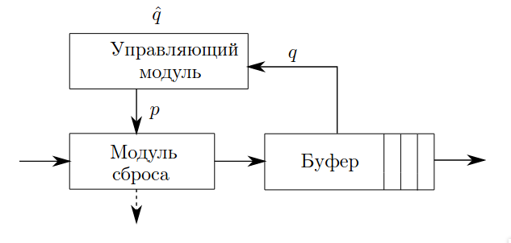
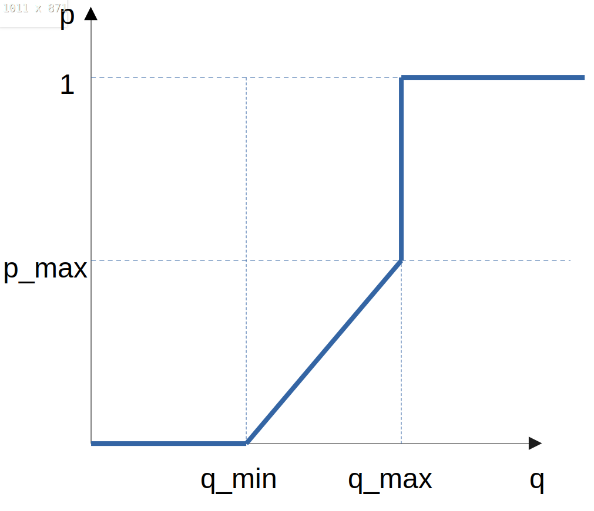
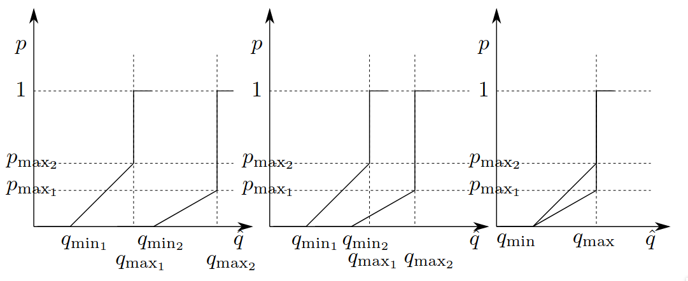
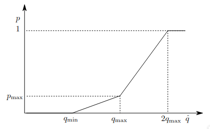

---
## Front matter
title: "Курсовая работа"
##subtitle: "Простейший вариант"
author: "Тагиев Байрам Алтай оглы"

## Generic otions
lang: ru-RU
toc-title: "Содержание"

## Bibliography
bibliography: bib/cite.bib
csl: pandoc/csl/gost-r-7-0-5-2008-numeric.csl

## Pdf output format
toc: true # Table of contents
toc-depth: 2
lof: true # List of figures
lot: true # List of tables
fontsize: 12pt
linestretch: 1.5
papersize: a4
documentclass: scrreprt
## I18n polyglossia
polyglossia-lang:
  name: russian
  options:
	- spelling=modern
	- babelshorthands=true
polyglossia-otherlangs:
  name: english
## I18n babel
babel-lang: russian
babel-otherlangs: english
## Fonts
mainfont: DejaVu Serif
romanfont: DejaVu Serif
sansfont: DejaVu Sans
monofont: DejaVu Sans Mono
mainfontoptions: Ligatures=TeX
romanfontoptions: Ligatures=TeX
sansfontoptions: Ligatures=TeX,Scale=MatchLowercase
monofontoptions: Scale=MatchLowercase,Scale=0.9
## Pandoc-crossref LaTeX customization
figureTitle: "Рис."
tableTitle: "Таблица"
listingTitle: "Листинг"
lofTitle: "Список иллюстраций"
lotTitle: "Список таблиц"
lolTitle: "Листинги"
## Misc options
indent: true
header-includes:
  - \usepackage{indentfirst}
  - \usepackage{float} # keep figures where there are in the text
  - \floatplacement{figure}{H} # keep figures where there are in the text
---

# Сетевой симулятор - ns-2

## Что такое NS-2 и для чего он нужен?

NS-2 (Network simulator 2) - это симулятор дискретных событий, предназначенный для исследования сетей. NS-2 предоставляет существенную поддержку для моделирования протоколов TCP, маршрутизации и многоадресной рассылки по проводным и беспроводным (локальным и спутниковым) сетям.

NS - самый популярный выбор симулятора, используемый в исследовательских статьях, появляющихся на избранных конференциях, таких как `Sigcomm`. ns постоянно поддерживается и обновляется своей большой базой пользователей и небольшой группой разработчиков в ISI.

Сам по себе NS-2 просчитывает то, что происходит в симуляции, но для наглядности нам нужна визуализация всего процесса. Для этого был создан NAM - Network Animator. NS вместе со своим компаньоном, nam, образуют очень мощный набор инструментов для обучения концепциям сетевого взаимодействия. NS содержит все основные протоколы IP. С помощью NAM эти протоколы можно визуализировать в виде анимации. 

## Что мы можем сделать с помощью этих инструментов?

Создавать:

1. Наземные, спутниковые и беспроводные сети с различными алгоритмами маршрутизации (DV, LS, PIM-DM, PIM-SM, AODV, DSR).

2. Источники трафика, такие как Web, ftp, telnet, cbr, случайный трафик.

3. Сбои, включая детерминированные, вероятностные потери, сбой связи и т.д.

4. Различные дисциплины организации очередей (drop-tail, RED, FQ, SFQ, DRR и т.д.) и QoS (например, IntServ и Diffserv).

Визуализировать:

1. Поток пакетов, наращивание очереди и отбрасывание пакетов.

2. Поведение протокола: медленный запуск TCP, саморегулирование, контроль перегрузки, быстрая повторная передача и восстановление.

3. Перемещение узлов в беспроводных сетях.

4. Аннотации для освещения важных событий.

5. Состояние протокола (например, TCP cwnd).

# Аналоги

Самые известные и популярные аналоги NS-2:

 - NS-3

 - Cisco Packet Tracer
 
 - MIMIC Simulator

## MIMIC Simulator

MIMIC Simulator - это набор продуктов Gambit Communications, состоящий из программного обеспечения для моделирования в области управления сетями и системами.

Пакет MIMIC Simulator Suite содержит несколько компонентов, связанных с имитацией управляемых сетей и центров обработки данных в целях разработки программного обеспечения, тестирования или обучения программного обеспечения, продаж и маркетинга приложений для управления сетями.

MIMIC SNMP решает классическую задачу моделирования: программное обеспечение системы управления сетью или поддержки операций обычно управляет большими сетями. Традиционно для создания таких сетей для вышеуказанных целей физическое оборудование приобреталось отдельно и монтировалось в лабораториях. Чтобы снизить затраты, большая часть сети может быть смоделирована

## Packet Tracer

Packet Tracer - это кроссплатформенный инструмент визуального моделирования, разработанный Cisco Systems, который позволяет пользователям создавать сетевые топологии и имитировать современные компьютерные сети. Программное обеспечение позволяет пользователям моделировать конфигурацию маршрутизаторов и коммутаторов Cisco, используя имитированный интерфейс командной строки. Packet Tracer использует пользовательский интерфейс перетаскивания, позволяющий пользователям добавлять и удалять имитируемые сетевые устройства по своему усмотрению.

Packet Tracer позволяет пользователям создавать имитированные сетевые топологии путем перетаскивания маршрутизаторов, коммутаторов и различных других типов сетевых устройств. Физическое соединение между устройствами представлено элементом "кабель". Packet Tracer поддерживает множество имитируемых протоколов прикладного уровня, а также базовую маршрутизацию с помощью RIP, OSPF, EIGRP, BGP.

## NS-3

NS-3 является прямым наследником NS-2. NS-3 построен с использованием C++ и Python с возможностью написания сценариев. Библиотека NS обернута в Python благодаря библиотеке pybindgen, которая делегирует синтаксический анализ заголовков NS C++ в castxml и pygccxml для автоматической генерации соответствующего связующего элемента C++. Эти автоматически сгенерированные файлы C++ в конечном итоге компилируются в модуль NS Python, чтобы позволить пользователям взаимодействовать с моделями C++ NS и ядром с помощью скриптов Python. Симулятор NS оснащен интегрированной системой на основе атрибутов для управления значениями параметров моделирования по умолчанию и для каждого экземпляра.

# RED

## Теоретическое введение

RED (@red) (Random Early Detection - Произвольное раннее обнаружение) -- Алгоритм активного управления очередью для управления переполнением очередей маршрутизаторов, с возможность предотвращения перегрузок.

Вероятность $p_{b}$ маркировки на отбрасывание пакетов представляет собой функцию, линейно зависящую от $\hat{q}$, минимального $q_{min}$ и максимального $q_{max}$ пороговых значений и параметра $p_{max}$, определяющего часть отбрасываемых пакетов при достижении средним размером очереди значения $q_{max}$ и вычисляется следующим образом:

$$
p_{b} = \left\{ \begin{array}{cl}
0, &  \  0 < \hat{q} \leq q_{min} \\
1, &  \ \hat{q} > q_{max} \\
\frac{\hat{q} - q_{min}}{q_{max} - q_{min}} p_{max}, & \ q_{min} < \hat{q} \leqslant q_{max} \\
\end{array} \right.
$$

## Сравнение с DropTail

DropTail относится к пассивному типу управления очередью (PQM). Он сохраняет пакет до тех пор, пока буфер не заполнится, и когда буфер заполнится, т.е. в очереди не останется свободного места, он начинает отбрасывать каждый пакет. Существуют две возможные вероятности выпадения, т.е. 0 или 1. Вероятность отбрасывания пакета равна 0, если количество поступивших пакетов меньше количества буферизованных пакетов, и в обратном случае она будет равна 1.

Основным отличием между RED и DropTail является то, что RED позволяет контролировать пропускную способность и более эффективно управлять трафиком, тогда как Droptail не гарантирует равномерное распределение пропускной способности. (@redcomparison)

## Разбор алгоритм работы RED

Пакет при поступлении в систему попадает в модуль сброса. Решение о сбросе пакета принимается на основе значения вероятности $p$, получаемого от управляющего модуля. Вероятность $p$ сброса пакетов зависит от экспоненциально взвешенного скользящего среднего размера длины очереди $\hat{q}$, также вычисляемого управляющим модулем, основы- ваясь на текущем значении длины очереди $q$.

{#fig:001 width=50%}

Вероятность потери пакета в зависимости от среднего размера очереди будет выглядеть следующим образом:

{#fig:002 width=40%}

## Разбор реализации в NS2

Файлы, связанные с RED находятся по пути `ns-2.35/queue`, там представлены различные реализации очередей (среди них DropTail, RED и т.д.). Для нас важны два файла:

 - `red.h` -- Заголовочный файл
 - `red.cc` -- Исходники

В файле red.cc для нас интересна функция `REDQueue::estimator` и функция `double REDQueue::calculate_p_new`. Первая функция отвечает за расчет средней длины очереди. Вторая -- расчитывает вероятность потери пакета.

Разберем исходный код второй функции:

```cpp
double 
REDQueue::calculate_p_new(double v_ave, double th_max, int gentle, double v_a, 
	double v_b, double v_c, double v_d, double max_p)
{
	double p;
	if (gentle && v_ave >= th_max) {
		// Необходимо для GRED (подробнее о GRED ниже)

		// p находится в промежутке от max_p до 1,
		// тогда как средний размер очереди в промежутке
		// q_max и 2*q_max
		p = v_c * v_ave + v_d;
        } else if (!gentle && v_ave >= th_max) { 
		// Превысили пороговое значение в классическом RED
		// p приравниваем к 1
                p = 1.0;
        } else {
		// p в промежутке от 0 до max_p, тогда как
		// средний размер очереди в промежутке
		// th_min до th_max
                p = v_a * v_ave + v_b;
                // p = (v_ave - th_min) / (th_max - th_min)

                p *= max_p; 
        }
	if (p > 1.0)
		p = 1.0;
	return p;
}
```

## Проблемы RED

Одна из фундаментальных проблем RED заключается в том, что он полагается на длину очереди в качестве показателя загруженности. Хотя наличие постоянной очереди указывает на перегрузку, ее длина дает очень мало информации о серьезности перегрузки.

Поскольку алгоритм RED зависит от длины очереди, ему присуща проблема определения степени перегрузки. В результате RED требует широкого диапазона параметров для корректной работы в различных сценариях перегрузки. Хотя RED может достичь идеальной рабочей точки, он может сделать это только при наличии достаточного объема буферного пространства и правильных параметров.

# WRED 

## Теоретическое введение

WRED (Weighted random early detection - Взвешенное произвольное раннее обнаружение) -- Алгоритм активного управления очередью, является расширением RED.

Взвешенный алгоритм произвольного раннего обнаружения предоставляет различные уровни обслуживания пакетов в зависимости от вероятности их отбрасывания и обеспечивает избирательную установку параметров механизма RED на основании типа трафика.

{#fig:003}

Алгоритм WRED работает с единой очередью пакетов, для которой, как и в RED, по формуле рассчитывается экспоненциально взвешенное скользящее среднее. Для каждого типа трафика задаются собственные параметры (пороговые значения, максимальный уровень сброса) и вычисляется вероятность сброса.

Например, очереди могут иметь более низкие пороговые значения для более низких приоритетов пакета. Это приведет к отбрасыванию пакетов с низким приоритетом, а следовательно, к защите пакетов с более высоким приоритетом в той же очереди.

# GRED

## Теоретическое введение

GRED (Gentle random early detection - мягкое/аккуратное произвольное раннее обнаружение) -- Алгоритм активного управления очередью, является расширением RED.

Gentle RED расширяет RED тем, что добавляет дополнительное максимальное пороговое значние, которое равно $2*q_{max}$, тем самым "сглаживая" кривую.

{#fig:004}

Вычисляется следующим образом:
$$
p_{b} = \left\{ \begin{array}{cl}
0, &  \  0 < \hat{q} \leq q_{min} \\
\frac{\hat{q} - q_{min}}{q_{max} - q_{min}} p_{max}, & \ q_{min} \leqslant \hat{q} < q_{max} \\
\frac{\hat{q} - q_{min}}{q_{max}}(1-p_{max}) - p_{max}, & \ q_{max} \leqslant \hat{q} < 2q_{max} \\
1, &  \ \hat{q} \geqslant  q_{max} \\
\end{array} \right.
$$

# Список литературы{.unnumbered}

::: {#refs}
:::
